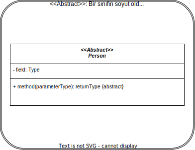
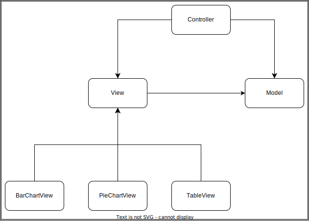

# 2. Week - 13 October 2022 Thursday

# Tasarım Kalıplarına Giriş

* Yazılım tasarımında karşılaşılan belirli sorunların yalın ve güzel çözümlerinin tarifidir (soyut veya somut olabilir).

Kalıpların Ana Bileşenleri:
* İsim: Kalıbı en güzel şekilde anlatacak bir isim.
* Sorun: Çözülen sorunun tarifi.
* Çözüm: Önerilen tasarım bileşeni.
* Tartışma/Sonuçlar: Çözümün sistemin geneline esneklik, genişletilebilirlik ve diğer kalıplar ile ilişkisi yönünden incelenmesi.

Yararları:
* Tekerleği yeniden icat etmemek.
* Üzerinde birçok deneyimli kişinin emeği geçtiğinden, 'kaliteli' bir çözüm.
* Deneyimin yazılı biçimde aktarılabilmesi.
* Yazılım ekibi arasında ortak bir sözlük oluşturulması.

Gang of Four: Dörtlü Çete

Kullanılan sınıf şemalarında italik yazı soyut anlamına gelmektedir. Fakat elle çizimde italik yazılar belli olmayacağı için sterotype olarak aşağıdaki şekilde ilgili yere abstract olduğu bilgisi yazılmalıdır.
* `<<Abstract>>`: Sınıflara koyuyoruz
* `{Abstract}`: Metotlara koyuyoruz



## Creational Design Patterns: Yaratımsal Tasarım Kalıpları
Nesnelerin oluşturulması, temsili ve ilişkilendirilmelerindeki bağımlılığı azaltmaya yönelik kalıplardır.
## Structural Design Patterns: Yapısal Tasarım Kalıpları
Sınıflar ve nesnelerin bir araya getirilerek daha büyük yapılar elde edilmesine yönelik kalıplardır.
## Behavioral Design Patterns: Davranışsal Tasarım Kalıpları
Sorumlulukların nesnelere dağıtılması ve algoritma seçimine yönelik kalıplardır.

# BEHAVIORAL (DAVRANIŞSAL) DESIGN PATTERNS

## 1) MODEL-VIEW-CONTROLLER (MVC) DESIGN PATTERN
Behavioral Design Pattern olarak nitelendirilir.  
Sorun:
* Aynı veriyi farklı biçimlerde gösterebilmek istiyoruz.
* Kullanıcının verinin nasıl gösterileceğini seçmebilme hakkı vermek istiyoruz.

Çözüm:
Veriyi, verinin gösterimini ve gösterimin yönetimini ayrı sınıflar olarak temsil etmek.

Model Sınıfı: Ham veriyi simgeler.  
View Sınıfı: Verinin çeşitli gösterim biçimlerini oluşturur.  
Controller Sınıfı: Kullanıcı komutlarını alıp işler. View yönteminin değiştirilmesi gibi işlemler.



Örnek Uygulama:
* Seçim sonuçlarında %5 barajının altında kalanları pie chart üzerinde birleştirip diğer olarak ve tüm hepsinin toplamının % si olarak göster.
* Diğer bir yöntem %5 in altında kalanları ayrı ayrı göster.

Veride bir değişiklik olduğunda, nasıl çizimlere yansıtabiliriz?
* Çözüm 1: Controller ın belirli periyot la sorgulayarak veriyi güncellemesi.
* Çözüm 2: Model değiştiğinde View e haber verilmesi.
* Çözüm 3: Observer Design Pattern kullanılabilir. İlerde anlatılacak.

# CREATIONAL (YARATIMSAL) DESIGN PATTERNS

## 2) ABSTRACT FACTORY DESIGN PATTERN
Creational Design Pattern olarak nitelendirilir.  
Bir pattern de factory ismmi geçiyorsa, bir nesne yaratma işlemi olduğunu anlayabiliriz.  

Amaç: Birbirleri ile ilişkili yada aynı aileden olan nesneleri, sınıflarını belirtmeden oluşturabilmek.  
Amaç: Neyin sık değiştiğini bul ve onu sarmala. Böylece bu konu ile ilgili değişiklikler sadece bu kısmı etkiler.

Klasik Yöntemde: Switch-Case ile enum değerleri yönetilerek yapılacak.
* Zayıf Yönü: Switch-Case ler her yeni bir sınıf eklendiğinde güncellenecektir.

```Java
// Klasik Yöntem

abstract class Renderer {
    public void renderOpA();
    public void renderOpB();
}

class OpenGLRenderer extends Renderer {
    public void renderOpA() {
        // Implementation...
    }

    public void renderOpB() {
        // Implementation...
    }
}

class DirectXRenderer extends Renderer {
    public void renderOpA() {
        // Implementation...
    }

    public void renderOpB() {
        // Implementation...
    }
}

// Aşağıdaki bizi bir noktaya kadar idare eder.
// Yeni DirectX sürümleri çıktı (10, 11, 12, etc.)?
// Yeni bir switch eklenmesi gerekecek.
// Daha iyisi abstract factory ile mümkün.

Renderer renderer;

switch (library) {
    case OpenGL:
        renderer = new OpenGLRenderer();
        break;
    case DirectX:
        renderer = new DirectXRenderer();
        break;
}

// Yukarıdaki switch-case yapısını abstract factory pattern ile yaparsak aşağıdaki gibi olur.

abstract class ComponentFactory {
    public Renderer createRenderer();
}

class OpenGLFactory extends ComponentFactory {
    public Renderer createRenderer() {
        // Implementation...
    }
}

class DirectXFactory extends ComponentFactory {
    public Renderer createRenderer() {
        // Implementation...
    }
}

Renderer renderer;
ComponentFactory factory;

// Böylelikle yeni bir nesne oluşturulacağı alelen
// beyan edilmiş olmaktadır. Tüm kontroller factory
// sınıfına devrediliyor. Yeni bir renderer implementasyonu
// için sadece factory de değişiklik yapılması yeterli.
renderer = factory.createRenderer();
```
