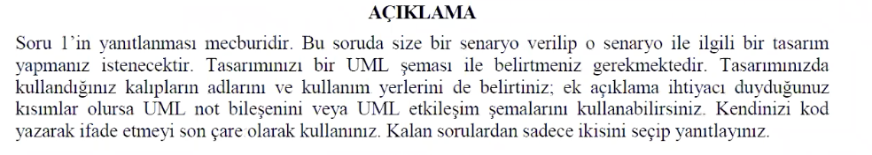
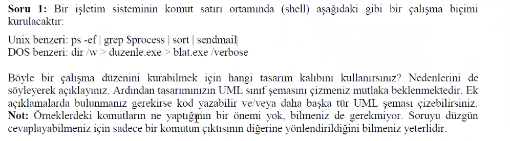
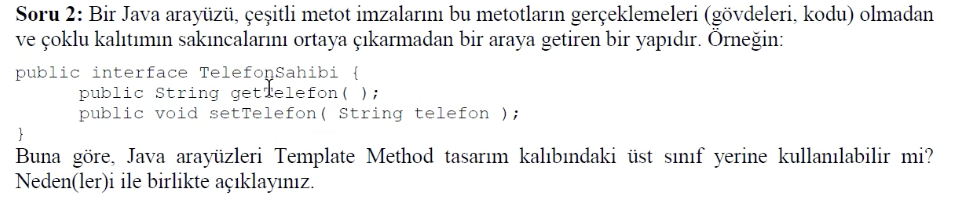
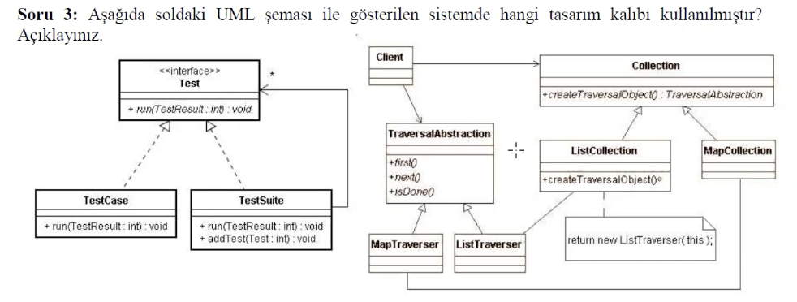
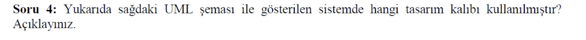

# 11. Week - 15 December 2022 Thursday

# CODE SMELLS - DIVERGENT CHANGE - SHOTGUN SURGERY

* **Divergent Change:** Aynı sınıfın çok farklı noktalarında değişiklik yapmak gerekiyorsa kullanılan tabirdir.

* **Shotgun Surgery:** Birden fazla sınıfın çok farklı noktalarında değişiklik yapmak gerekiyorsa kullanılan tabirdir. Geniş alanda yapılan değişikliklerdir.

Çözüm:  
Extract Class yazmak.  
Move Method / Move Field yapmak.  
...

## Solution: Refactoring - Move Method
Bir method en çok çağıran sınıfın içerisinde olacak şekilde bulunmalı. Eski sınıftan silinir. Yeni sınıftaki method çağrılır.

# CODE SMELLS - PRIMITIVE OBSESSION
İlkel tiplerin aşırı kullanılması takıntısı olma durumu.
* Yapısal programlama ile daha önce çok uzun çalışmış kişiler bunu genelde yapıyorlar.
* Bir sınıf ile ifade edilmesi (modellenmesi) gereken bir veriyi ilkel bir veri tipi olarak modellemek.

Refactoring Solutions:
* Refactoring - Replace Data Value with Object
* Refactoring - Replace Type Code with Class: Enum Class kullanımı daha iyi
* Refactoring - Replace Type Code with Subclasses: 2 veya 3 sınıfa ayırabiliriz. 
  * Employe: den türetilen Engineer ve Salesman ayrı sınıflar olmalı.
  * Employe üst sınıfı içerisinde mühendis ve satış elemanı ayrımı yapılacak bir durum oluşmuyor olmalı.
* Refactoring - Replace Type Code with State/Strategy
* Refactoring - Replace Array with Object: 

```
takımlar: String    Liverpool   Arsenal     M. United    
puanlar: int        25          34          32
averajlar: int      3           5           10

Yerine aşağıdaki gibi bir class ve getter/setter metodları oluşturalım.
Team[teamCount] teams;

teams[0].getTeamName();
teams[0].getPoints();
teams[0].getAverage();

gibi
```
# CODE SMELLS - FEATURE ENVY
Bir metot ait olduğu sınıfın üyerlerinden çok başka sınıfın metdolarını kullanıyorsa "özellik kıskançlığı" denilmektedir.
* Bu durumda yapılacak en güzel şey bu metodu eğer yapılabiliyorsa diğer sınıfa taşımaktır.

# REFACTORING ÖRNEĞİ - İLK DURUM

Basit bir video kiralama örneği. Daha önceki haftalarda yazılan örnek refactor ediliyor.

## Refactoring Örneği - 1. Müdahale
* Video kiralama örneği customer.java içerisindeki switch case statement refactor edildi. Yeni bir metoda taşındı.
* Dışarıya verdiğimiz hizmetleri değiştirmeden sadece sınıf içerisine yeni bir metod ekleyip, yine sınıf içerisinde çağırdık.

## Refactoring Örneği - 2. Müdahale
Renaming the variables
* thisAmount yerine result ismi kullanıldı. Refactor --> Rename ile yapıldı.

## Refactoring Örneği - 3. Müdahale
Kiralama işleminden  kazanılan puanları getBonus() metodu ile alınacak şekilde düzenleme yapılır.

# ANTI PATTERN - KARŞIT KALIPLAR
Tasarım kalıpları gibi yaygın olarak kullanılan fakat yanlış olan kullanımlardır.

# Vize Bilgi
Saat 13:30 gibi 2. vize başlayacaktır.  
TODO: Bir problem verilecek. Hangi tasarım kalıbıyla çözülmesi daha uygun olur diye sorulacak. (Önceki vizedeki 1. soruya benzer 2 tane soru olacak bundan).  
TODO: UML Sınıf şeması çizimi istenir. Bu konuya çalış.

## Geçmiş Vize Soruları

2:00:00 dan sonra vize 1'in sorularına bakıyoruz.  
UML sınıf şeması çizimide yapmak gerekiyor.



**Soru 1:**


**Cevap:** Bir komutun çıktısının başka bir komutun girdisi olduğu durumlarda **decorator design pattern** kullanılabilir. Her bir komut yeni bir yetenek ekliyor gibi düşünülebilir.

**Soru 2:**


**Cevap:** Interface ler hiçbir şekilde implementasyonu olan metod içermezler. Bu nedenle Template Method kalıbında kullanımı mümkün değildir. Abstract class lar kullanılarak ortak olan temel metodlar base abstract class a alınarak bu sınıflardan türetme yapılması template metod larda kullanılır.

**Soru 3:**  


**Cevap:** Aşağıda soldaki UML şeması ile gösterilen sistemde hangi tasarım kalıbı kullanılmıştır? Açıklayınız.  
Soldaki tasarımda parça bütün ilişkisi var bu nedenle composite kalıbı kullanılmıştır diyebiliriz.

**Soru 4:**


**Cevap:** Yukarıda sağdaki UML şeması ile gösterilen sistemde hangi tasarım kalıbı kullanılmıştır. Açıklayınız.  
Sağdaki tasarımda veri yapısı oluşturma ve saklanma şekli ile bridge e benziyor. Fakat iterator kalıbı kullanılmıştır.
